# Architecture Notes

Architecture visuals:

- [`docs/media/dataset-skill-architecture.svg`](./media/dataset-skill-architecture.svg)
- [`docs/media/industry-pipeline.svg`](./media/industry-pipeline.svg)

## Diagram Mapping

The plan diagrams define four main layers:

1. primary orchestrator
2. cognitive sub-skills
3. deterministic scripts
4. resources and workspace state

This repository maps those layers as follows.

## 1. Primary Orchestrator

- [`SKILL.md`](../SKILL.md)

Responsibilities:

- route user intent
- decide whether the run is generate, verify, audit, or export
- decide when to resume or start fresh
- select the relevant sub-skills
- choose the output schema path

See [[Generation Workflow]] for the routing matrix that maps user intents
to script invocations.

## 2. Cognitive Layer

- [`sub-skills/dataset-strategy.md`](../sub-skills/dataset-strategy.md)
- [`sub-skills/seed-generator.md`](../sub-skills/seed-generator.md)
- [`sub-skills/diversity-engine.md`](../sub-skills/diversity-engine.md)
- [`sub-skills/dpo-pair-generator.md`](../sub-skills/dpo-pair-generator.md)
- [`sub-skills/quality-filter.md`](../sub-skills/quality-filter.md)
- [`sub-skills/llm-judge.md`](../sub-skills/llm-judge.md)
- [`sub-skills/deduplicator.md`](../sub-skills/deduplicator.md)
- [`sub-skills/formatter-exporter.md`](../sub-skills/formatter-exporter.md)
- [`sub-skills/data-card.md`](../sub-skills/data-card.md)
- [`sub-skills/data-verifier.md`](../sub-skills/data-verifier.md)
- [`sub-skills/dataset-auditor.md`](../sub-skills/dataset-auditor.md)
- [`sub-skills/grounding-checker.md`](../sub-skills/grounding-checker.md)
- [`sub-skills/research-planner.md`](../sub-skills/research-planner.md)

Responsibilities:

- reasoning
- planning
- taxonomy design
- schema choice
- judging guidance
- workflow selection
- research and evidence gathering

## 3. Deterministic Script Layer

Pipeline scripts in [`scripts/`](../scripts/):

- [`generate.py`](../scripts/generate.py) — turn collected/user material into canonical records
- [`build_loop.py`](../scripts/build_loop.py) — orchestrate generate → verify → dedup → coverage → audit → export
- [`coverage.py`](../scripts/coverage.py) — measure bucket coverage, joint-bucket skew, and structural collapse
- [`augment.py`](../scripts/augment.py) — diversity transforms (tone, persona, difficulty, adversarial)
- [`verify.py`](../scripts/verify.py) — heuristics, schema validation, refusal/anti-trope/grounding gates
- [`dedup.py`](../scripts/dedup.py) — exact and near-duplicate detection (MinHash/LSH) with configurable signature surface
- [`audit.py`](../scripts/audit.py) — corpus-wide audit including context-leakage and provenance checks
- [`export.py`](../scripts/export.py) — preset and custom flat-schema exports, plus auto data card
- [`collect.py`](../scripts/collect.py) — chunk content from web searches, URLs, and local files
- [`research.py`](../scripts/research.py) — native research/evidence pipeline
- [`grounding.py`](../scripts/grounding.py) — evidence-anchored grounding score with stopword filter
- [`quality_report.py`](../scripts/quality_report.py) — corpus-level quality summary
- [`review_batch.py`](../scripts/review_batch.py) — adjudicate LLM-as-judge review files
- [`browser_collect.py`](../scripts/browser_collect.py) — optional Playwright-backed collection

Shared utilities in [`scripts/utils/`](../scripts/utils/):

- [`db.py`](../scripts/utils/db.py) — SQLite-backed resumable run state (see below)
- [`canonical.py`](../scripts/utils/canonical.py), [`schema.py`](../scripts/utils/schema.py) — canonical-record normalization and validation
- [`coverage_plan.py`](../scripts/utils/coverage_plan.py), [`research_plan.py`](../scripts/utils/research_plan.py) — plan-driven coverage/research metadata
- [`similarity.py`](../scripts/utils/similarity.py), [`source_dedup.py`](../scripts/utils/source_dedup.py) — duplicate detection backends
- [`source_quality.py`](../scripts/utils/source_quality.py), [`dpo_quality.py`](../scripts/utils/dpo_quality.py), [`code_quality.py`](../scripts/utils/code_quality.py) — per-record quality scoring
- [`benchmark_guard.py`](../scripts/utils/benchmark_guard.py), [`security.py`](../scripts/utils/security.py), [`visibility.py`](../scripts/utils/visibility.py), [`web.py`](../scripts/utils/web.py), [`files.py`](../scripts/utils/files.py)

Responsibilities:

- normalize/import canonical records
- orchestrate batch-wise quality loops across generate -> verify -> dedup -> coverage -> audit -> export
- measure effective post-dedup count, bucket gaps, joint-bucket skew, provenance, response-length drift, response-structure collapse, response-prefix repetition, and metadata completeness during generation
- manage resumable SQLite state
- apply deterministic heuristics plus plan-driven required-field and provenance gates
- apply duplicate suppression with configurable `--dedup-on` surfaces
- sanitize model-visible `instruction` and `context` during export when the plan defines `model_visibility`
- export into fixed presets or custom flat schemas

A per-script reference is maintained at [[Script Inventory]].

## 4. Resources and Workspace

- canonical schema: [`resources/internal-schema/canonical_schema.json`](../resources/internal-schema/canonical_schema.json) — single record model that represents SFT and DPO examples uniformly
- preset export schemas: [`resources/target-schemas/`](../resources/target-schemas/)
- custom schema starter: [`resources/templates/custom_flat_schema.json`](../resources/templates/custom_flat_schema.json)
- audit/export references: [`resources/references/`](../resources/references/)
- runtime state: [`workspace/`](../workspace/)

## SQLite Run State

`scripts/utils/db.py` owns the resumable state model. Each build loop opens a
`workspace/build_loop_build_<hash>.sqlite` database that tracks:

- canonical records keyed by stable id
- per-record lifecycle status (`draft`, `verified`, `rejected`, `deduped`, `exported`)
- coverage-bucket counters
- verification and grounding scores
- review-batch adjudications

Because every pipeline stage reads from and writes to the same DB, a run
can be interrupted and resumed without re-collecting or re-judging records.
The `.sqlite` files are gitignored; never commit run artifacts.

## Phase 14 Deterministic Quality Gates

The latest hardening pass adds these always-on gates inside `verify.py`,
`audit.py`, and `dedup.py`:

- **Refusal-regex anchoring** — refusal patterns now anchor on full
  utterances so fragments like "I cannot" inside legitimate content do
  not falsely match.
- **Anti-trope detection** — templated assistant phrasings ("As an AI
  language model", "I am happy to help with that", etc.) are flagged so
  generated records do not regress into chatbot voice.
- **DPO chosen-side checks** — chosen responses are run through the same
  refusal, anti-trope, and grounding gates as standalone records, so the
  preferred side cannot be worse than the rejected side on any dimension.
- **Context-leakage audit** — `audit.py` walks model-visible fields and
  flags any plan/system text that leaked into `instruction` or
  `context` during generation.
- **Instruction-only dedup mode** — `dedup.py --dedup-on instruction`
  catches prompt repetition independently of response diversity.
- **Grounding stopword filter** — `grounding.py` strips stopwords from
  evidence comparisons and raises the minimum grounding score to 0.20 so
  weakly-supported records are dropped.

## Key Design Decision

The biggest adaptation from the plan is the execution model:

- Reasoning phases are not implemented as external API calls.
- They are executed by the host coding assistant environment.
- Local scripts handle only deterministic transforms and persistence.

That keeps the pipeline aligned with Codex, Antigravity, and Claude Code skill usage.

## See Also

- [[Generation Workflow]] — end-to-end recipe with example prompts
- [[Script Inventory]] — per-script flags and outputs
- [`CHANGELOG.md`](../CHANGELOG.md) — release notes and gate history
